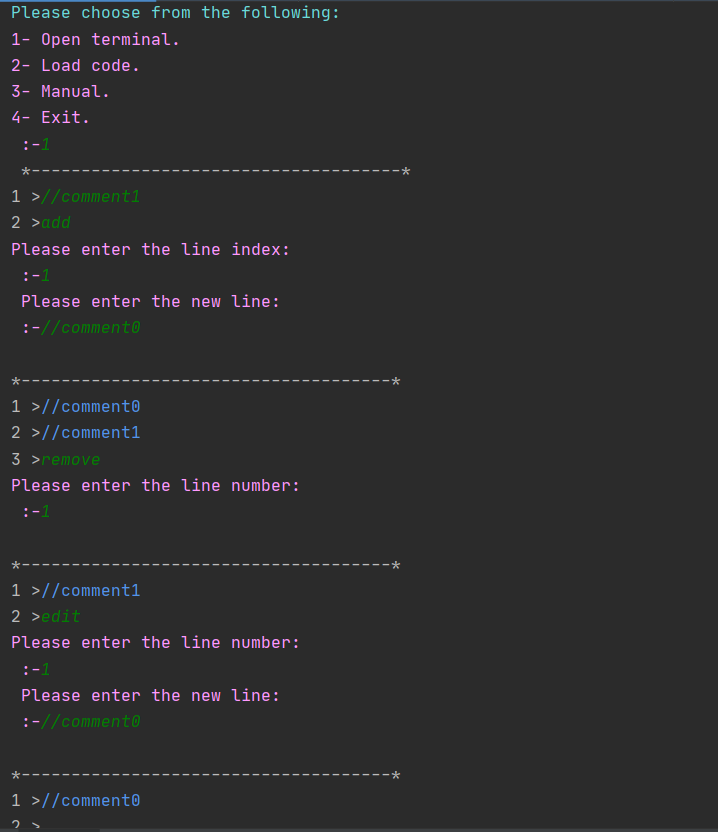
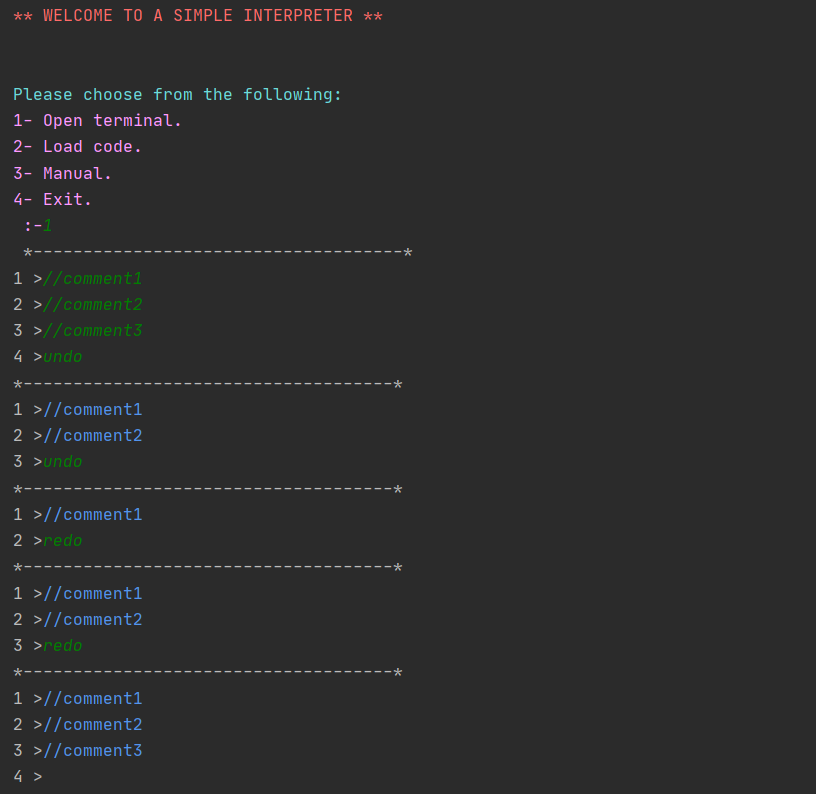
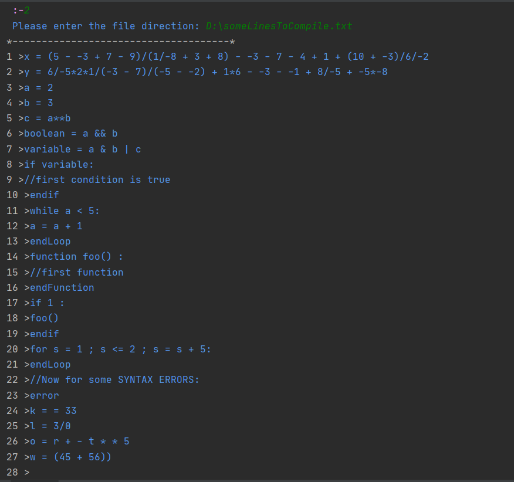
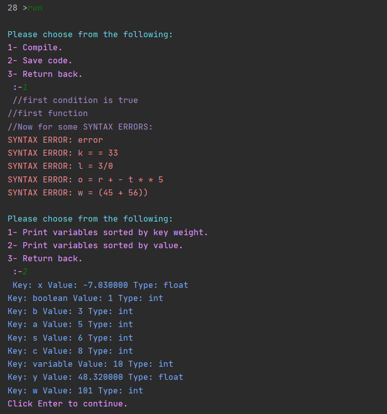
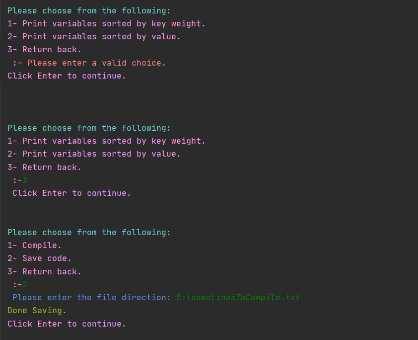
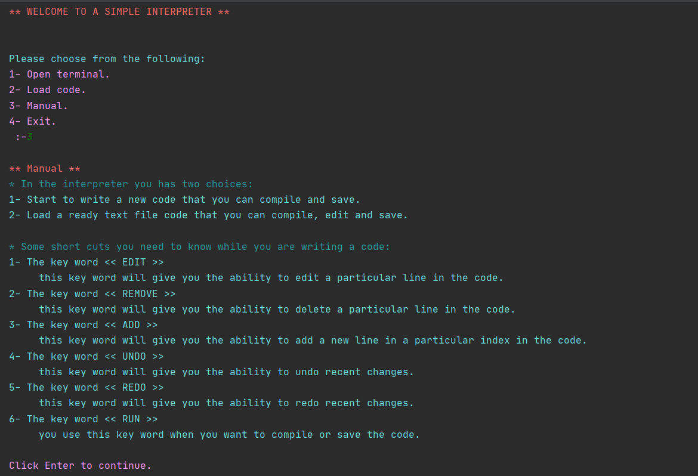

# Welcome to simple interpreter

- **This project is for education purposes.**
- ***This interpreter written in c.***

> This interpreter can handle:
>  1. Int and float variables
>  2. Expressions
>  3. If statements
>  4. Label statement
>  5. Functions
>  6. While loops
>  7. For loops
>  8. Comments

```
    Some Notes:
    
     • Functions share the same stack of the program, so all the variables are global.
     • Comments must be in in a separate line.
     • You don't need to declare the variables type.
```

## Syntax

**Declaring variables:**

> Variable name must start with underscore `_` or an alphabet character `A to Z`.\
> Variable name can consist of underscores or characters or digits.\
> Examples:
> - [x] name
> - [x] _name
> - [x] _name1

**Expressions:**

> Operators:
> 
> 
>  - Not `!`
>  - Power `**`
>  - Multiplication  `*`
>  - division `/`
>  - Mod `%`
>  - Plus `+`
>  - Minus `-`
>  - Left shift `<<`
>  - Right shift `>>`
>  - Greater than `>`
>  - Smaller than `<`
>  - Greater than or equal `>=`
>  - Smaller than or equal `<=`
>  - Equal to `==`
>  - Not equal to `!=`
>  - Bit wise and `&`
>  - Bit wise or `|`
>  - XOR `^`
>  - Logical AND `&&`
>  - Logical OR `||`
>  - Equal assign `=`
>  - Multiply assign `*=`
>  - Division assign `/=`
>  - Mod assign `%=`
>  - Plus assign `+=`
>  - Minus assign `-=`
>  - Left shift assign `<<=`
>  - Right assign `>>=`
>  - Bit wise and assign `&=`
>  - Bit wise or assign `|=`
>  - XOR assign `^=`

Operators precedence:


|1             |2   |3   |4   |5   |6   |7   |8   |9   |10     |11  |
|--------------|----|----|----|----|----|----|----|----|-------|----|
|!             |    |    |    |    |    |    |    |    |       |    |
|\*\*          |    |    |    |    |    |    |    |    |       |    |
|*             |/   |%   |    |    |    |    |    |    |       |    |
|+             |-   |    |    |    |    |    |    |    |       |    |
|<<            |>>  |    |    |    |    |    |    |    |       |    |
|<             |<=  |\>  |>=  |    |    |    |    |    |       |    |
|==            |!=  |    |    |    |    |    |    |    |       |    |
|&             |    |    |    |    |    |    |    |    |       |    |
|^             |    |    |    |    |    |    |    |    |       |    |
|&#124;            |    |    |    |    |    |    |    |    |       |    |
|&&            |    |    |    |    |    |    |    |    |       |    |
|&#124;&#124;  |    |    |    |    |    |    |    |    |       |    |
|=             |\*= |/=  |%=  |+=  |-=  |<<= |\>>=|&=  |&#124;=|^=  |

> Examples:
- > x *= - - - - - - 3 - + - + 4 * 4 + + + 2 \*\* 2
- > y = 2/6 + -3 - -2 + -4/-10 + 2\*6 + (7 + -7)\*-5/2/(3 - 5 + 4\*4)
- > s = 3 & 4 || 3 ^ 2
- > m = !((s = 5) && 0 ) || 3 <= 2

**If statements:**

> The if statement should start with the key word `if` then the `condition` then `:`.\
> After that you can write the scope  of the function.\
> Then you can close the condition with the key word `endif`.

```
if #Condition# :
//scope
endif
```
  
 > Examples:

     

 - > if 3 <= 2 :\
   > //condition should be false\
   > endif
        
 - > if 1 && (2 > 1) || 3 :\
     > //condition should be true.\
     > endif

**Label statement:**

> The label statement should start with a valid variable declaring `labelName` then a colon `:`.\
> If you want to go to the label statement all what you need is to use the key word `goto` then write the label name `labelName`.

```
labelName:
//Some lines
goto labelName
```

> Examples: 

 - > start:\
   > //comment\
   > goto start

> 

 - > x = 5\
   > start:\
   > if x < 15 :\
   > x += 5\
   > goto start\
   > endif

**Functions:**

> To declare a function you need to start with the key word `function` then the function name `functionName` then the parameters `(x , y)` and finally the colon `:`.\
> Then you can write the scope of the function, and in the end of the function you need to close the function scope with the closing key word `endFunction`.
> 
> When you want to call the function all what you need is to write the function name `functionName` then the parameters `(1 , 2)`.

```
function #functionName# ( # parameters #) :
# The scope of the function #
endFunction
```

and to call it:

```
#functionName# (# parameters #)
```

> Examples:
> 

 - > function firstFunction (x , y) :\
   > //comment\
   > endFunction
   > 
   > firstFunction (1, 2)

> 

 - > function secondFunction () :\
   > //some lines\
   > endFunction
   > 
   > secondFunction()

**While loops:**

> To declare a while loop you need to start with the `while` key word then the `condition` then the colon `:`.\
> After that you can write the scope of the loop, then you need to close the loop with the key word `endLoop`.

```
while # Condition # :
#scope#
endLoop
```

> Examples: 

 - > while 1 :\
   > //comment\
   > endLoop

> 

 - > x = 0\
   > while x < 10 :\
   > x += 1\
   > endLoop

**For loops:**

> To declare a for loop you need to start with the `for` key word then the `control variable` after that a semicolon `;` then `condition` after that a semicolon again `;` then `changing variable value` and finally the colon `:`.\
> After that you can write the scope of the loop, then when you want to close the loop you need to use the key word `endLoop`.

```
for #control variable# ; #condition# ; #changing variable value expression# :
# The scope of the loop #
endLoop
```

> Examples: 

 - > x = 0\
   > for x ; x < 10 ; x += 1 :\
   > //comment\
   > endLoop

> 

 - > for i = 100 ; i >= 0 ; i -= 1 :\
   > //some lines\
   > endLoop

**Comments:**

> To declare a variable all what you need is to start the line with two forward slashes `//` then the `comment`.

```
// #comment#
```

> Examples: 

 - > // This is the first comment

> 

 - > // This is the second comment


## Extra features

 1. The interpreter has a simple text editor.
 2. You can load a ready text file that you can edit, compile and save.
 3. You can start to write a new code that you can compile and save.

**Some key words you need to know wile you are writing a code:**

 - The key word `EDIT`

> this key word will give you the ability to edit a particular line in
> the code.

 - The key word `REMOVE`
> this key word will give you the ability to delete a particular line in
> the code.

     

 - The key word `ADD`
> this key word will give you the ability to add a new line in a
> particular index in the code.

     

 - The key word `UNDO`
> this key word will give you the ability to undo recent changes.

     

 - The key word `REDO`
> this key word will give you the ability to redo recent changes.

     

 - The key word `RUN`
> you use this key word when you want to compile or save the code.

## Snapshots













